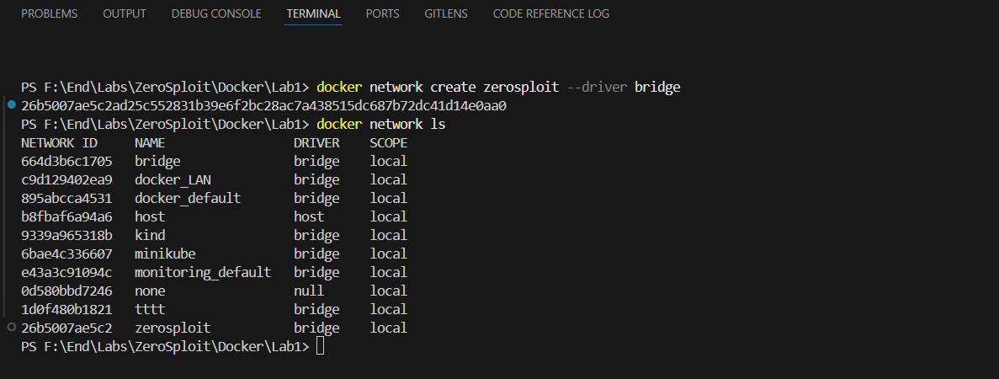

# Lab1


# Simple BackEnd App
```bash
I use NodeJS to build BackEnd App

npm init -y  ---->  create "Package.json"

npm install express  ---->  Provides simplified methods for setting up a "web server" in Node.js

node app.js  ---->  Run App Locally

```

# Prepare Docker Image
```bash
# Write your Docker file & Build Image from it
docker build -t simpleimage .
```

# Create Custom bridge Network
```bash
docker network create zerosploit --driver bridge
```


# Create Container use "zerosploit" Network
```bash
docker run -d --name nti -p 5050:30000 --network zerosploit simpleimage
```


# Final Output
